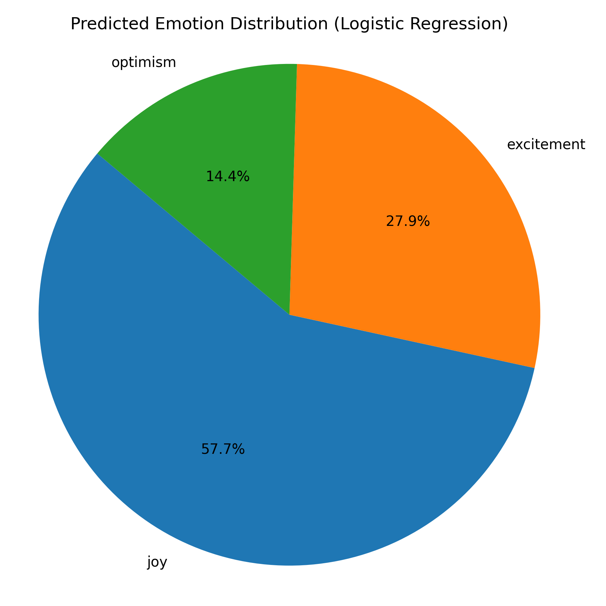
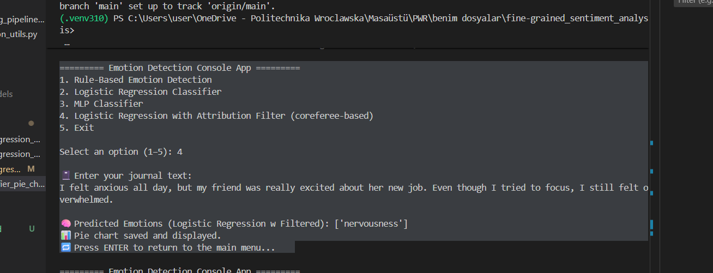

# Fine-Grained Sentiment Analysis Console Application  
### 🎓 MSc Thesis Prototype – Emotion Analysis for Mental Health Applications

This repository contains the prototype developed as part of my MSc thesis at  
**Wrocław University of Science and Technology (2025)**:

> **"A Method for Fine-Grained Sentiment Analysis, in Textual Data, for Mental Health Applications."**

The goal of this project is to analyze free-text journal entries and detect detailed emotional states using both **rule-based** and **AI-based** NLP techniques.  
It serves as the core research and experimentation environment for future extensions such as a **FastAPI backend** and a **Flutter-based mobile application**.

---

## 🧠 1. Motivation and Problem Statement

Traditional sentiment analysis models typically classify text into only three categories:  
**positive, negative, neutral.**

However, mental-health scenarios require a far more nuanced understanding of human emotions.  
Patients express their psychological states through:

- free-writing  
- journaling  
- informal self-report text  
- indirect emotional cues  

This project aims to detect **fine-grained emotional states**, addressing key limitations in mental-health applications:

- → Oversimplified emotion categories  
- → Sensitivity and privacy concerns  
- → Need for an offline, lightweight approach  
- → Difficulty in detecting subtle, multi-label emotions  

---
## ▶️ 2. How to Run the Project (Setup & Execution)

Follow these steps to run the console application locally.

---

### 1️⃣ Clone the repository

```bash
git clone https://github.com/Seda-turkoz/fine-grained-sentiment-analysis-console-app.git
cd fine-grained-sentiment-analysis-console-app
```

---

### 2️⃣ Create and activate a virtual environment

**Windows:**

```bash
python -m venv .venv
.\.venv\Scripts\activate
```

**macOS/Linux:**

```bash
python3 -m venv .venv
source .venv/bin/activate
```

---

### 3️⃣ Install dependencies

```bash
pip install -r requirements.txt
```

---

### 4️⃣ Run the console app

```bash
python main.py
```

You will see:

```
========= Emotion Detection Console App =========
1. Rule-Based Emotion Detection
2. Logistic Regression Classifier
3. MLP Classifier
4. Logistic Regression with Attribution Filter
5. Exit
```

---

### 5️⃣ (Optional) Re-generate embeddings or retrain models

```bash
python ai_based/embedding_pipeline.py
python ai_based/logistic_regression/train_logistic_regression.py
python ai_based/mlp/train_mlp_classifier.py
```
---

## 🧩 3. Project Features

### ✔️ Rule-Based Emotion Detection  
- 12-emotion custom taxonomy  
- Lexicon built from clinical literature and extended contextual phrases  
- Pure Python implementation  
- High interpretability  
- Offline by design  

### ✔️ AI-Based Emotion Classifier  
- Embedding model: **DistilBERT (HuggingFace Transformers)**  
- Classifiers:
  - Logistic Regression  
  - MLPClassifier  
- Trained on **GoEmotions (28 labels)**  
- Evaluated using:
  - Precision / Recall  
  - Macro F1  
  - Weighted F1  
  - Per-class performance breakdown  

### ✔️ Emotion Attribution Layer  
Identifies whether detected emotions belong to the **writer** (1st person)  
or to **other people** mentioned in the journal entry.  
This is essential for accurate psychological interpretation.

### ✔️ Console Interface  


The application provides an interactive text-based menu:

========= Emotion Detection Console App =========
1. Rule-Based Emotion Detection
2. Logistic Regression Classifier
3. MLP Classifier
4. Logistic Regression with Attribution Filter (coreferee-based)
5. Exit


Each option allows you to run a different emotion analysis module:

1: Uses the custom 12-emotion rule-based lexicon

2: Runs the AI-based Logistic Regression classifier (DistilBERT embeddings)

3: Runs the MLP classifier (DistilBERT embeddings)

4: Runs Logistic Regression enhanced with an Attribution Filter (coreference resolution)

5: Exits the program


---

## 🧱 4. Tech Stack

| Component | Technology |
|----------|------------|
| Programming Language | Python 3.10 |
| Embedding Model | DistilBERT (HuggingFace) |
| Classifiers | scikit-learn (LogReg, MLP) |
| Data | Google GoEmotions (58k samples, 28 labels) |
| Visualization | Matplotlib |
| Development | VSCode + virtual environment |

---

## 📂 5. Project Structure

📦 fine-grained-sentiment-analysis-console-app
┣ 📄 main.py     # Console menu interface
┣ 📁 ai_based/
┃ ┣ embedding_pipeline.py 
┃ ┣ visualization_utils.py
┃ ┣ logistic_regression/
┃ ┣ logistic_regression_w_filter/
┃ ┗ mlp/
┣ 📁 rule_based/emotion_detector.py
┣ 📁 utils/ label_map.py, save_labels.py
┣ 📁 tests/
┣ 📁 archive/(datasets, preprocessing outputs, older experiments)
┗ 📁 visuals/(evaluation charts used in thesis)

---


## 📊 6. Example Output: Logistic Regression vs Logistic Regression + Attribution Filter

The following example demonstrates how the **baseline Logistic Regression classifier**
and the **Attribution Filter–enhanced version** behave differently when the input text
contains emotions belonging to multiple people.

### 📝 Input Text
"I felt anxious all day, but my friend was really excited about her new job.  
Even though I tried to focus, I still felt overwhelmed."


### 📈 A) Logistic Regression (No Filtering)

The standard Logistic Regression classifier analyzes the entire sentence as a
single emotional unit.  
It does **not** distinguish between the writer’s emotions and emotions attributed to
other people.

As a result, the model produces a distribution based on *all* detected emotions:




In this case, emotions such as **amusement** and **desire** may be detected due to
contextual noise or references to other individuals, even if they do not reflect
the writer’s actual emotional state.


### 📉 B) Logistic Regression + Attribution Filter (Coreference-Based)

The Attribution Filter uses **coreference resolution (coreferee)** to identify
whether each emotion refers to:

- the *writer* (first-person: “I”, “me”), or  
- *someone else* (“my friend was excited”).  

Emotions assigned to other entities are removed.

**Filtered Output:**

Predicted Emotions (Logistic Regression w Filtered): ['nervousness']



---

## 📈 7. Experimental Results (Summary)

### 🔹 Logistic Regression
- **Accuracy:** ~33%  
- **Macro F1:** ~0.35  
- **Weighted F1:** ~0.45  
- Best performance on: *gratitude*, *love*  
- Struggles on low-frequency labels

### 🔹 MLPClassifier
- **Accuracy:** ~31.7%  
- **Macro F1:** 0.28  
- **Weighted F1:** ~0.41  
- Performs well on clear positive emotions  
- Harder classes: *disapproval*, *realization*

### 🔹 Key Findings
- AI-based methods outperform rule-based methods in overall accuracy  
- Rule-based approach is more interpretable but limited in scalability  
- DistilBERT embeddings significantly enhance traditional classifiers  
- Emotion Attribution Layer improves contextual accuracy  

---

## 🚀 8. Future Development

This repository represents the **research phase** of the project.  
Future plans include:

### 🔸 Backend (Next stage)
- FastAPI-based REST API  
- Real-time journal submission  
- ONNX / TFLite support for lightweight models  

### 🔸 Mobile Application (Flutter)
A separate repository will implement a Flutter app with:

- Journal entry page  
- Emotion detection integrated with API  
- Offline inference mode  
- Dashboard for emotion history  

### 🔸 Model Improvements
- Better handling of rare emotion classes  
- Few-shot and semi-supervised learning  
- Multi-label neural architectures  
- Lightweight transformers (TinyBERT, MobileBERT)

---


## 🔐 9. Ethical & Privacy Considerations

This project was developed strictly for academic and research purposes as part of a university thesis.  
No real patient or user data is collected, processed, or stored at any stage of development.

All experiments are performed on publicly available datasets (such as Google’s GoEmotions).  
The system does not make clinical diagnoses, and the emotion detection output must not be interpreted as a psychological assessment.

The goal of this research is to explore NLP methods for fine-grained emotion analysis, not to replace professional mental-health evaluation.  
Human oversight and domain expertise remain essential in any real-world application involving emotional or psychological content.


---


## 👩‍💻 10. Author

**Seda Türköz**  
Mobile Developer (Flutter / .NET Core) & NLP Researcher  
MSc in Computer Engineering – Wrocław University of Science and Technology  
(Thesis: Fine-Grained Sentiment Analysis for Mental Health Applications)  
Wrocław, Poland  

GitHub: https://github.com/Seda-turkoz

---

## 📄 11. License

**MIT License**  
Free for academic, research, and personal use.

---